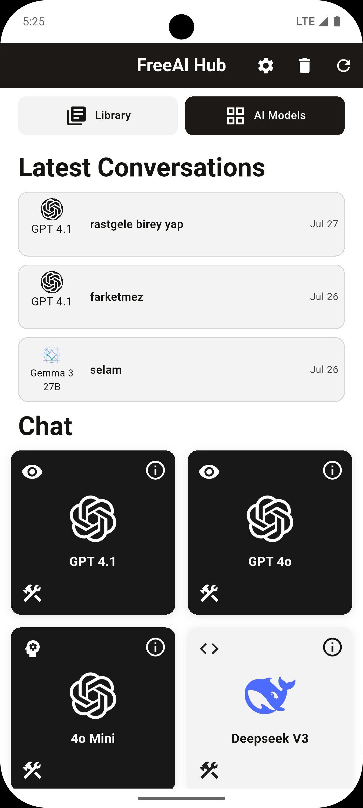
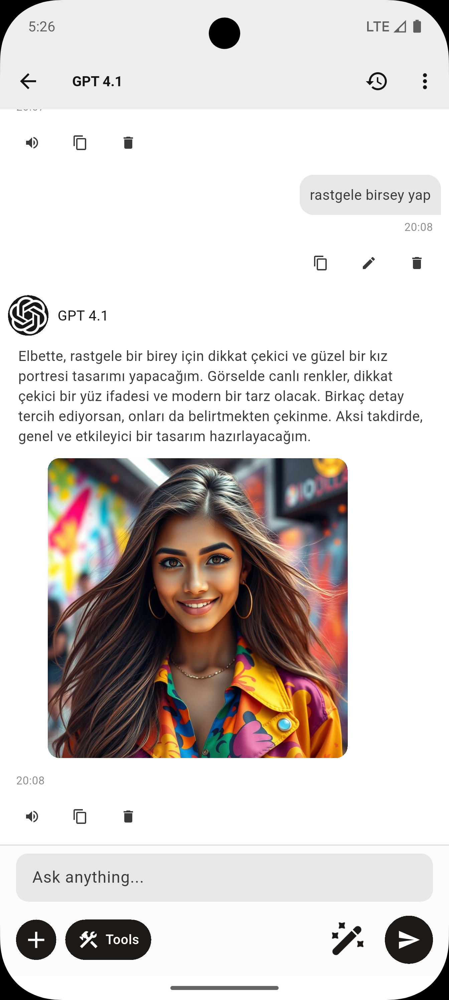
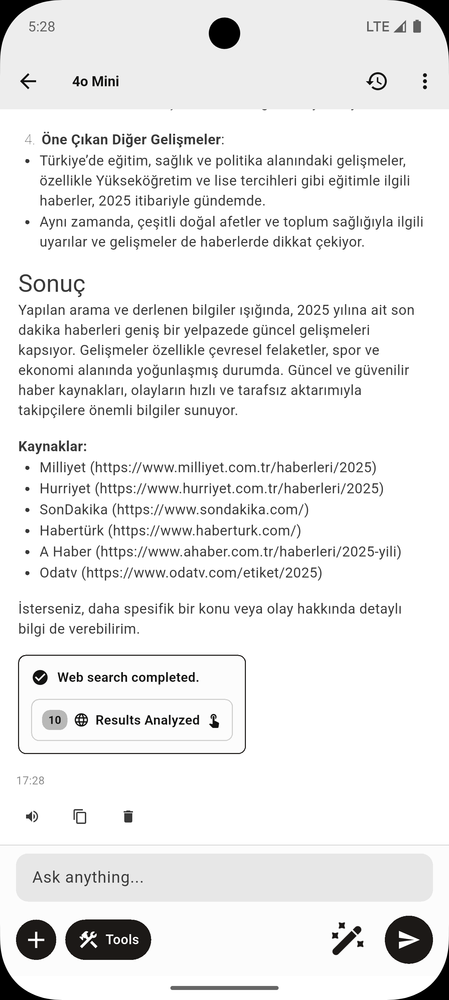
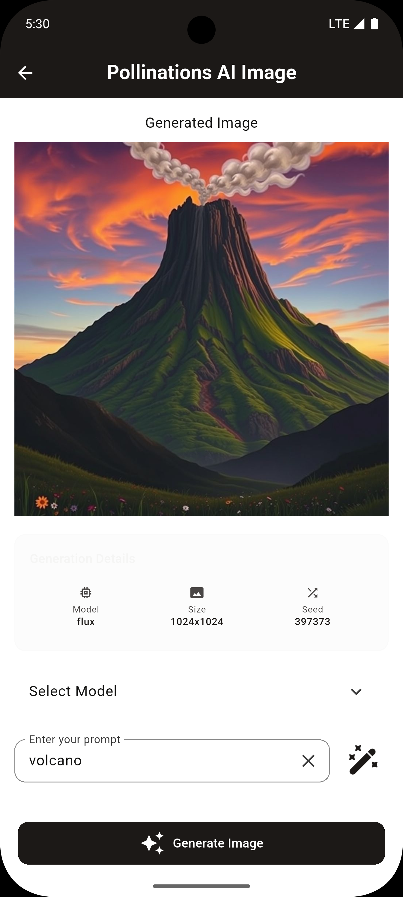

 <!-- Replace with your image path -->

# FreeAI Hub

## Description

This project, FreeAI Hub, is a Flutter application designed to provide users with access to a wide variety of AI functionalities. It leverages a modular architecture with a clear separation of concerns, utilizing GetX for state management and dependency injection.

The app serves as a hub for free AI tools, allowing users to interact with different AI models, generate images and audio, manage media libraries, and more.

## Features

- **Advanced AI Chat:** An interactive and feature-rich chat interface for communicating with various AI models. It provides visual feedback for AI states like thinking (`ThinkBlockWidget`) and typing (`TypingDotsWidget`), all managed by a robust `ChatController`.

- **Versatile Image Generation:** Tools for creating images from text prompts (`Text-to-Image`) and other images (`Image-to-Image`) using different AI models like `Hidream`. It offers advanced controls over the generation process, including image size, seed, guidance scale, and inference steps.

- **High-Quality Audio Generation:** A Text-to-Speech (TTS) feature powered by `Orpheus` that allows users to generate speech from text. It includes multiple voice options, adjustable parameters like temperature and repetition penalty, and supports paralinguistic cues (e.g., `<laugh>`, `<sigh>`) for more natural-sounding audio.

- **Custom AI Characters:** A dedicated section allowing users to create, manage, and interact with their own AI characters. Users can define a character's name, description, personality (via custom instructions), and creativity level (temperature).

- **Centralized Library:** A library hub to access user-created content. It provides entry points to `My AI Characters`, `My Medias`, and a planned `My Prompts` section.

- **Media Management:** A local media library to view, manage, and share images and audio files generated within the app.

- **Dynamic Theming:** Light and dark mode support with theme customization options.

- **Offline Support:** A fallback screen displayed when no internet connection is detected, offering retry and exit options.

## Screenshots

Here are some screenshots of the FreeAI Hub application:

<table>
  <tr>
    <td></td>
    <td></td>
    <td></td>
    <td></td>
  </tr>
</table>

## Installation

### Prerequisites
- Flutter SDK (version 3.32.8)
- Dart SDK
- Android/iOS emulator or physical device

### Steps
1. Clone the repository:
   ```
   git clone https://github.com/yourusername/open-free-ai-hub.git
   ```
2. Navigate to the project directory:
   ```
   cd open-free-ai-hub
   ```
3. Install dependencies:
   ```
   flutter pub get
   ```
4. Run the app:
   ```
   flutter run
   ```

## Usage

After launching the app:
- Set up your own env.dart file (Api keys etc.)
- Navigate through the home screen to select AI models or access the library.
- Use the chat interface to interact with AI.
- Generate images or audio via dedicated screens.
- Manage settings in the preferences section.

## Contributing

Contributions are welcome! Please follow these steps:
1. Fork the repository.
2. Create a new branch (`git checkout -b feature/AmazingFeature`).
3. Commit your changes (`git commit -m 'Add some AmazingFeature'`).
4. Push to the branch (`git push origin feature/AmazingFeature`).
5. Open a Pull Request.

## License

Distributed under the MIT License. See [LICENSE](LICENSE) for more information.

## Acknowledgments

- Built with Flutter
- Icons and assets from various sources
- Thanks to the open-source community